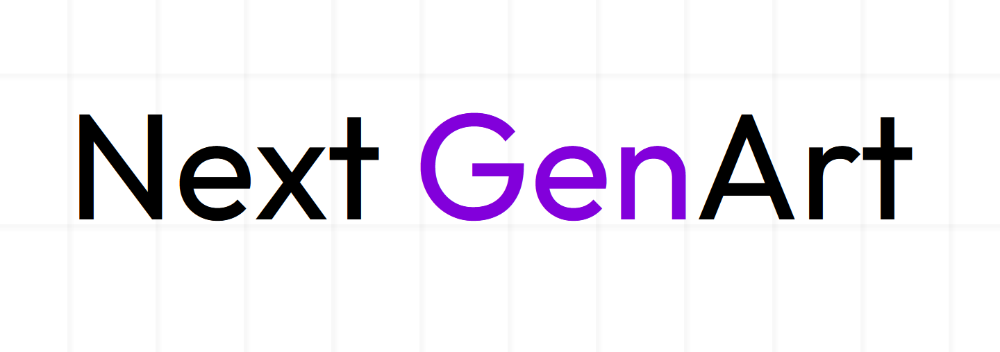
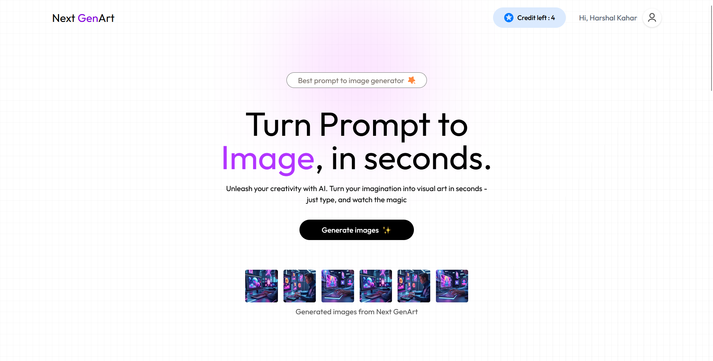
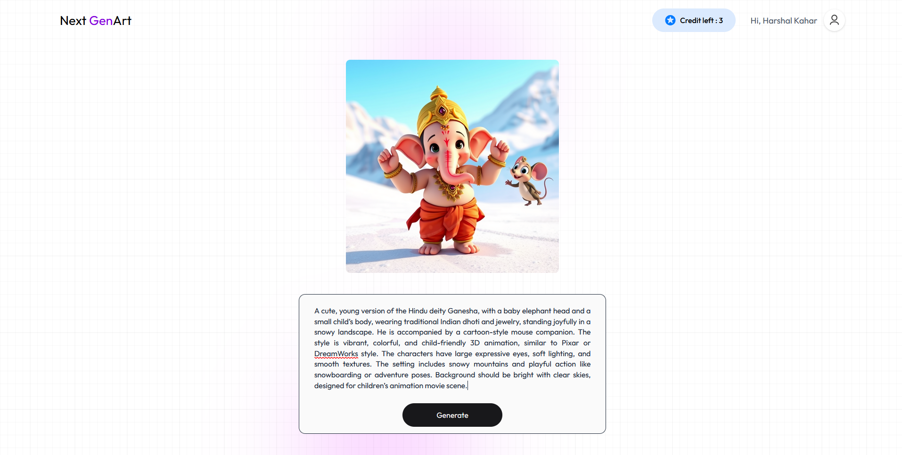
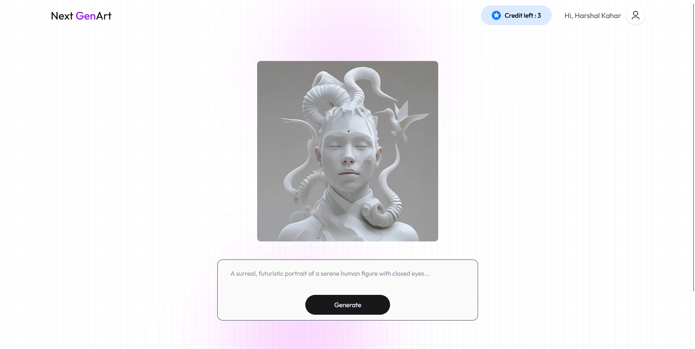
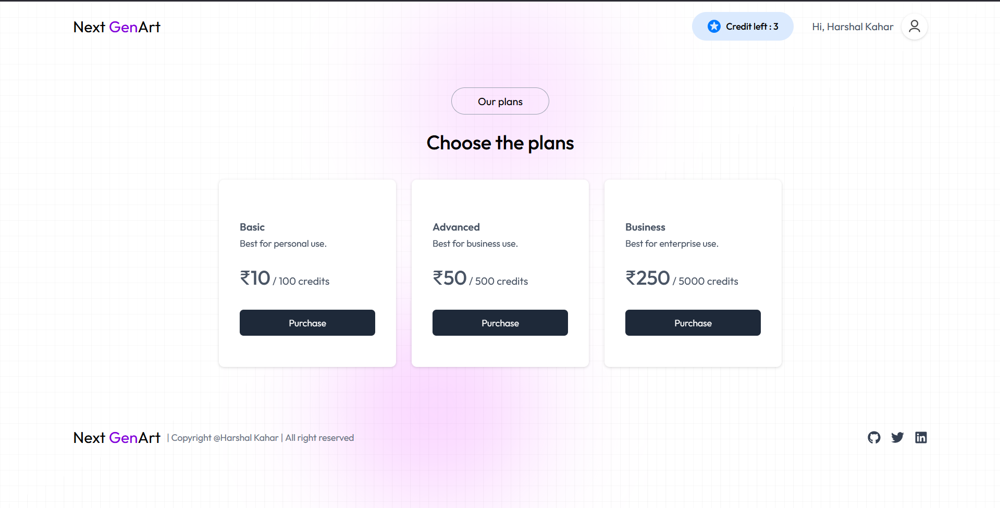
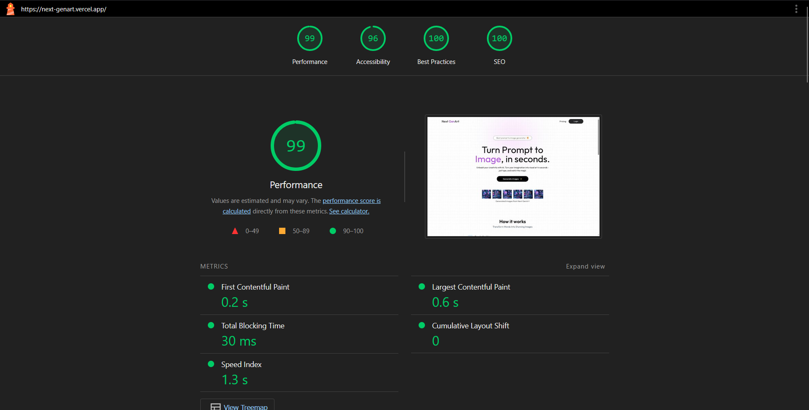

<div align="left" style="position: relative;">
  
<div style="display: flex; justify-content: space-between; align-items: center; width: 100%;">
  <div>
    <h1>Next GenArt - Prompt to AI Powered Image Generator</h1>
    <p>Transform your ideas into stunning visuals with AI-powered image generation!</p>
    <p>A full-stack application built with Next.js 15, React 19, Node.js, Express, and TypeScript that allows users to generate AI images from text prompts 🎨 with flexible credit-based plans. 🚀</p>
  </div>
  <div>
    
  </div>
</div>
	
### Next GenArt offers various features like:
-   🔐 **Authentication**:  
    ✨ SignUp,  
    🔑 Login,  
    👤 User Profile Management.
    
-   💳 **Payment Integration**:  
    💰 Credit-based system,  
    💸 Razor Pay integration,  
    🎁 Free credits for new users.
    
-   🖼️ **Image Generation**:  
    🤖 AI-powered image creation from text prompts,  
    ⬇️ Image downloading,  
    🔄 Multiple style options.
    
-   🎨 **User Experience**:  
    🌐 Fully responsive design,  
    ⚡ Optimized performance (99/100 Lighthouse score),  
    🚀 Fast image generation and delivery.

</p>

<p align="left">
	
	
	
	
</p>
<p align="left">Built with the tools and technologies:</p>
<p align="left">
	
       
</p>
</div>

---

## 🔗 Table of Contents

- [📍Overview](#overview)
- [📸 Screenshots](#screenshots)
- [👾 Features](#features)
- [📊 Performance](#performance)
- [📁 Project Structure](#project-structure)
- [🚀 Getting Started](#getting-started)
  - [☑️ Prerequisites](#prerequisites)
  - [⚙️ Installation](#installation)
  - [🏃 Running the Application](#running-the-application)
- [📌 Project Roadmap](#project-roadmap)
- [🔰 Contributing](#contributing)
- [🎗 License](#license)
- [📝 About the Author](#about-the-author)
- [🙌 Acknowledgments](#acknowledgments)

---

## Overview

Next GenArt is a cutting-edge AI-powered image generation platform that transforms text prompts into stunning visuals. Built with modern technologies like Next.js 15, React 19, and TypeScript, it offers a seamless user experience with a credit-based system for generating images. The application integrates Razor Pay for secure transactions and features a highly optimized frontend with a perfect Lighthouse performance score.

## Screenshots

<table>
  <tr>
    <td>
      
    </td>
    <td>
      
    </td>
  </tr>
  <tr>
    <td align="center">Home Page</td>
    <td align="center">Image Generation</td>
  </tr>
  <tr>
    <td>
      
    </td>
    <td>
      
    </td>
  </tr>
  <tr>
    <td align="center">Results Page</td>
    <td align="center">Credit Purchase</td>
  </tr>
</table>

---

## Features

|      | Feature         | Summary       |
| :--- | :---:           | :---          |
| ⚙️  | **Architecture**  | <ul><li>Modern full-stack application with Next.js 15 frontend and Node.js/Express backend</li><li>TypeScript for type safety across the entire codebase</li><li>MongoDB for data persistence and user management</li><li>RESTful API design with proper validation and error handling</li></ul> |
| 💳 | **Credit System**  | <ul><li>Credit-based model for generating images</li><li>Free credits (5) for new users</li><li>Multiple credit packages available for purchase</li><li>Secure payment processing with Razor Pay integration</li></ul> |
| 🖼️ | **Image Generation** | <ul><li>Integration with ClipDrop API for high-quality AI image generation</li><li>Text-to-image conversion with customizable options</li><li>Fast processing and delivery of generated images</li><li>Download functionality for generated images</li></ul> |
| 🔒 | **Authentication**  | <ul><li>Secure user registration and login</li><li>JWT-based authentication</li><li>Protected routes and API endpoints</li><li>User profile management</li></ul> |
| 🎨 | **User Experience**    | <ul><li>Responsive design that works on all devices</li><li>Optimized performance with 99/100 Lighthouse score</li><li>Custom font implementation with next/font</li><li>Intuitive UI with clear navigation and feedback</li></ul> |
| ⚡️  | **Performance**   | <ul><li>Optimized image loading with next/image</li><li>Font optimization with next/font/local</li><li>Lazy loading of non-critical components</li><li>Minimized CLS (Cumulative Layout Shift) for better user experience</li><li>Reduced animations on largest contentful paint</li></ul> |

---

## Performance

Next GenArt has achieved an exceptional Lighthouse performance score of 99/100 through several optimization techniques:



### Optimization Journey:
1. **Initial Score: 51/100**
2. **Image Optimization: 71/100**
   - Implemented next/image with proper height, width
   - Added lazy loading and priority image properties
3. **Font Optimization: 77/100**
   - Used next/font/local for downloaded fonts
   - Preloaded critical fonts
4. **Script Optimization: 85/100**
   - Lazy loading with Script tag for non-critical components
   - Deferred loading of third-party scripts
5. **CLS Improvements: 99/100**
   - Avoided conditional rendering based on state
   - Used Tailwind CSS classes (hidden/flex/block) for toggling visibility
   - Reduced animations through framer motion on largest content paint
   - Simplified animations with CSS

---

## Project Structure

```sh
📦 next-genart
├─ client
│  ├─ app
│  │  ├─ assets.ts
│  │  ├─ buy
│  │  │  └─ page.tsx
│  │  ├─ globals.css
│  │  ├─ layout.tsx
│  │  ├─ page.tsx
│  │  ├─ result
│  │  │  └─ page.tsx
│  │  ├─ types.d.ts
│  │  └─ ui
│  │     └─ fonts.ts
│  ├─ components
│  │  ├─ Description.tsx
│  │  ├─ Footer.tsx
│  │  ├─ GenerateButton.tsx
│  │  ├─ Header.tsx
│  │  ├─ Loader.tsx
│  │  ├─ Login.tsx
│  │  ├─ Navbar.tsx
│  │  ├─ Steps.tsx
│  │  └─ Testimonials.tsx
│  ├─ config
│  │  └─ index.ts
│  ├─ context
│  │  └─ AppContext.tsx
│  ├─ lib
│  │  ├─ client-api.ts
│  │  └─ types.ts
│  └─ public
│     ├─ assets
│     │  ├─ [various SVG and PNG files]
│     └─ fonts
│        └─ outfit
│           ├─ [font files]
└─ server
   ├─ config
   │  ├─ index.ts
   │  ├─ mongoose.ts
   │  └─ razorpay.ts
   ├─ controllers
   │  ├─ imageController.ts
   │  └─ userController.ts
   ├─ index.ts
   ├─ middlewares
   │  ├─ authHandler.ts
   │  ├─ errorHandler.ts
   │  ├─ responseMiddleware.ts
   │  └─ validateRequest.ts
   ├─ models
   │  ├─ TransactionModel.ts
   │  └─ UserModel.ts
   ├─ routes
   │  ├─ imageRoutes.ts
   │  └─ userRoutes.ts
   └─ validations
      ├─ imageValidation.ts
      └─ userValidation.ts
```

---

## Getting Started

### Prerequisites

Before getting started with Next GenArt, ensure your runtime environment meets the following requirements:

- **Version Controller:** Git
- **Programming Language:** Node.js (v16+)
- **Package Manager:** npm or yarn

### Installation

Install Next GenArt using the following steps:

1. Clone the repository:
   ```bash
   git clone https://github.com/harshal255/next-genart
   ```

2. Set up the server (backend):
   ```bash
   cd server
   npm install
   ```

   Create a `.env` file in the server directory with the following variables:
   ```
   PORT=4000
   MONGODB_URL_ATLAS=your_mongodb_connection_string
   JWT_SECRET=your_jwt_secret
   # https://clipdrop.co/apis
   CLIPDROP_API=your_clipdrop_api_key
   # Razor Pay
   RAZORPAY_KEY_ID=your_razorpay_key_id
   RAZORPAY_KEY_SECRET=your_razorpay_key_secret
   CURRENCY=INR
   ```

3. Set up the client (frontend):
open another terminal and then 
   ```bash
   cd client
   npm install
   ```

   Create a `.env` file in the client directory with the following variables:
   ```
   NEXT_PUBLIC_SERVER_URL=http://localhost:4000
   NEXT_PUBLIC_RAZORPAY_KEY_ID=your_razorpay_key_id
   ```

### Running the Application

1. Start the server:
   ```bash
   cd server
   npm run dev
   ```

2. Start the client:
   ```bash
   cd client
   npm run dev
   ```

3. Open your browser and navigate to `http://localhost:3000`

---

## Project Roadmap

- [X] **`Core Features`**: Basic image generation with credit system
- [X] **`Performance`**: Optimize to achieve 99/100 Lighthouse score
- [ ] **`User Gallery`**: Add personal gallery for saved generations
- [ ] **`Advanced Options`**: Add more customization options for image generation
- [ ] **`Social Sharing`**: Implement direct sharing to social media platforms
- [ ] **`Subscription Model`**: Add monthly subscription option alongside credit purchases

---

## Contributing

- **💬 [Join the Discussions](https://github.com/harshal255/next-genart/discussions)**: Share your insights, provide feedback, or ask questions.
- **🐛 [Report Issues](https://github.com/harshal255/next-genart/issues)**: Submit bugs found or log feature requests for the `next-genart` project.
- **💡 [Submit Pull Requests](https://github.com/harshal255/next-genart/pulls)**: Review open PRs, and submit your own PRs.

<details closed>
<summary>Contributing Guidelines</summary>

1. **Fork the Repository**: Start by forking the project repository to your GitHub account.
2. **Clone Locally**: Clone the forked repository to your local machine using a git client.
   ```sh
   git clone https://github.com/yourusername/next-genart
   ```
3. **Create a New Branch**: Always work on a new branch, giving it a descriptive name.
   ```sh
   git checkout -b feature/new-feature-name
   ```
4. **Make Your Changes**: Develop and test your changes locally.
5. **Commit Your Changes**: Commit with a clear message describing your updates.
   ```sh
   git commit -m 'Add: implemented new feature'
   ```
6. **Push to GitHub**: Push the changes to your forked repository.
   ```sh
   git push origin feature/new-feature-name
   ```
7. **Submit a Pull Request**: Create a PR against the original project repository. Clearly describe the changes and their motivations.
8. **Review**: Once your PR is reviewed and approved, it will be merged into the main branch. Congratulations on your contribution!
</details>

<details closed>
<summary>Contributor Graph</summary>
<br>
<p align="left">
   <a href="https://github.com/harshal255/next-genart/graphs/contributors">
      
   </a>
</p>
</details>

## License

This project is licensed under the MIT License - see the LICENSE file for details.

## About the Author
This project was developed by **Harshal Kahar**. Feel free to reach out with any questions or suggestions.
- Email: harshalkahar3@gmail.com
- GitHub: [harshal255](https://github.com/harshal255)
- LinkedIn: [harshal-kahar](https://www.linkedin.com/in/harshal-kahar)

## Acknowledgments

- Thanks to [ClipDrop API](https://clipdrop.co/apis) for powering the AI image generation
- Special thanks to all contributors who have helped improve this project
- Inspired by modern AI image generation tools and the potential of AI in creative processes
```

This read.md file follows the structure of the Conversa example but is tailored specifically for your Next GenArt project. It includes all the key information about your application, its features, performance optimizations, and setup instructions.

Would you like me to make any adjustments to the read.md file?